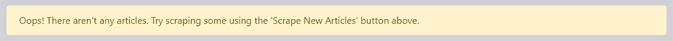
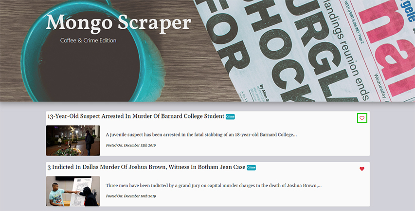
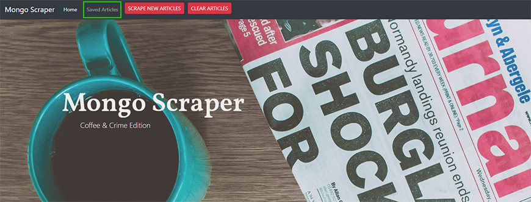
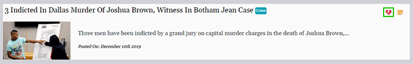
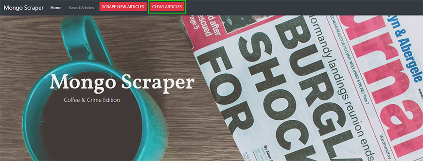
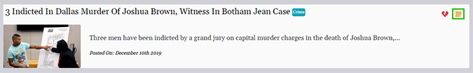
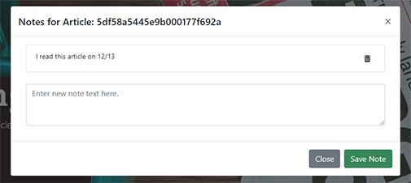
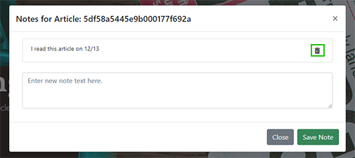

# Mongo Scraper: Coffee & Crime Edition

## Overview
This web app scrapes the latest news related to 'coffee' and 'crime' topics. The articles are pulled from the Huffington Post. Once the articles have been scraped, the user can save them to favorites and then add/save notes to the articles.

## Languages/Technologies Used
- HTML, CSS, JavaScript
- [jQuery 3.4.1](http://code.jquery.com/)
- [Bootstrap 4.3.1](https://getbootstrap.com/docs/4.3)
- [Node](https://nodejs.org/en/docs/)
    - [Express 4.x](https://expressjs.com/en/4x/api.html)
    - [Express-Handlebars 3.1.0](https://www.npmjs.com/package/express-handlebars)
    - [Axios 0.19.0](https://www.npmjs.com/package/axios)
    - [Cheerio 1.0.0-rc.3](https://cheerio.js.org/)
    - [Mongoose 5.7.14](https://mongoosejs.com/docs/guide.html)
    - [Moment 2.24.0](https://momentjs.com/docs/)
- [Font Awesome 5.10.2](https://fontawesome.com/how-to-use/on-the-web/referencing-icons/basic-use)

## Getting Started
Visit https://murmuring-cove-54695.herokuapp.com/.

### Prerequisites
- An internet browser with JavaScript enabled.

### Instructions
#### Articles
##### Scraping New Articles

If you receive the warning above that there currently are no articles, OR if the articles seem out of date, you can scrape new articles. 

1. Click the SCRAPE NEW ARTICLES button at the top of the window.
2. The page will refresh with the new articles.

##### Saving Articles
To save an article, you can click the heart icon all the way to the right of an article. An empty heart indicates the article is NOT saved, while a full heart represents a saved article.

To access saved articles, click the Saved Articles link at the top of the page.

##### Unsaving Articles
Clicking a full heart again will unsave the article. From the Saved Articles link, you can click the broken heart icon.

##### Deleting Articles
To completely clear out all of the articles, click the CLEAR ARTICLES button at the top of the screen. This will also remove existing notes.

#### Notes
##### Adding Notes
From the Saved Articles page, click on the note icon to the right of the article. 

Here, you will see any existing notes for that article. To add a new note, enter text into the text area and click Save Note.

##### Deleting Notes
To delete a note, click the trash can icon to the right of the note.

Alternatively, using the CLEAR ARTICLES button will also remove all notes.